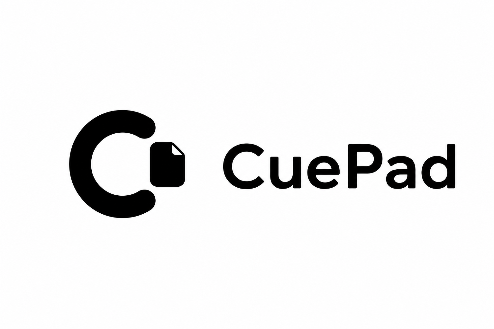

  

  

CuePad 是一个极轻量的本地桌面提示词草稿本，为 coding agents 场景设计：快速打开、顺手写作、自动保存，并能把提示词一键投送到刚才使用的终端或编辑器。

目前提供 macOS Electron 桌面应用，界面基于 Svelte，数据只保存在本机 SQLite。

## 功能

- **项目 / 卡片两层组织**：在横向项目栏切换当前项目，可置顶常用项目；「全局收藏」集中展示各项目的收藏卡片，未归档内容进入收件箱。
- **悬浮任务**：在主界面右侧随手记任务、分配项目、拖动排序、完成或恢复；窄窗口只保留一个任务入口。
- **沉浸编辑**：点击卡片进入全屏写作，`## 标题`、`- 列表`、代码块、`{{变量}}` 有轻量视觉增强，正文始终保存为纯文本。
- **自动保存**：输入后自动落库，保存失败不丢内容（本地备份 + 重试）。
- **分段复制**：正文中独占一行的 `---split---` 把草稿切成多段，可一键复制全文或任意一段。
- **一键投送（macOS）**：先把光标留在目标输入框；默认送到上一个应用，也可固定到当前运行的 Terminal、iTerm、Zed 或 VSCode。
- **变量模板**：复制或投送含 `{{变量}}` 的卡片前集中填写；同一卡片会记住上次的值。
- **全局搜索**：`Cmd/Ctrl + F` 呼出面板，搜项目、卡片标题/正文、标签，回车直达。
- **回收站**：项目和卡片软删除，可恢复或永久删除。
- **后台常驻**：关闭窗口只是隐藏；`Alt/Option + Space`（可在设置中改）随时呼出；托盘菜单可显示/隐藏/退出。
- **浅色 / 深色 / 跟随系统**三种主题；数据存本机 SQLite。

## 快捷键

| 快捷键 | 作用 |
| --- | --- |
| `Cmd/Ctrl + F` | 搜索 / 命令面板 |
| `Esc` | 退出沉浸编辑 / 关闭面板 |
| `Alt/Option + Space` | 全局显示 / 隐藏窗口（可自定义） |
