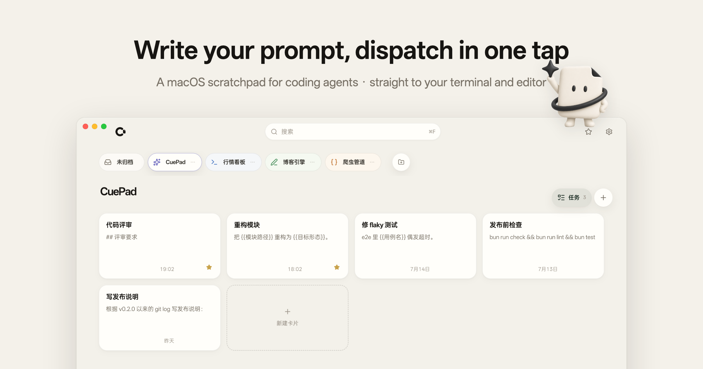

<p align="right">English | <a href="README.zh-CN.md">简体中文</a></p>

<p align="center">
  
</p>

<p align="center">
  <a href="LICENSE"></a>
  
</p>

**CuePad is the shortest path from idea to prompt.** A calm, paper-like scratchpad that lives beside your coding agents — write comfortably, autosave everything, then land your text in the terminal or editor you were just using. One keystroke, no window juggling.

100% local: your cards live in a SQLite file on your Mac.

<p align="center">
  
</p>

## Features

- **One-tap dispatch.** Leave your cursor in the target input, summon CuePad, hit send — the text lands right where you were typing. Pin Terminal, iTerm, Zed, or VSCode; optional auto-send presses Enter for you.
- **Immersive writing.** Full-screen cards with light styling for `## headings`, `- lists`, code blocks, and `{{variables}}`. Plain text in, plain text out — every keystroke autosaves.
- **Blocks.** `Shift+Enter` splits a draft into blocks. Copy or dispatch the whole card or any single block, with optional numbering.
- **Variable templates.** Fill `{{variables}}` right before copy or dispatch; each card remembers your last values.
- **Projects, favorites, tasks.** A horizontal project bar, global favorites, floating to-dos, and a trash that forgives.
- **Instant search.** `Cmd + F` searches projects, cards, and tags from anywhere.
- **Always within reach.** Lives in the tray, hides instead of closing, and returns with `Option + Space` (configurable). Light, dark, and system themes.

## Keyboard shortcuts

| Shortcut | Action |
| --- | --- |
| `Cmd/Ctrl + F` | Search / command palette |
| `Esc` | Exit immersive editing / close a panel |
| `Alt/Option + Space` | Show / hide the window globally (configurable) |

## Screenshots

<details>
<summary>Immersive editing / block dispatch / variable templates / global search / floating tasks / dark theme</summary>
<p align="center">
  
  
  
  
  
  
</p>
</details>

## Download

Apple Silicon: [download zip](https://github.com/Suge8/CuePad/releases/latest/download/CuePad-mac-arm64.zip). Product site: [cue-pad.com](https://cue-pad.com).

Ad-hoc signed, not notarized — on first launch, right-click the app and choose **Open**.

## Build from source

```bash
git clone https://github.com/Suge8/CuePad.git
cd CuePad
bun install
bun run package:app   # release/mac-arm64/CuePad.app + CuePad-mac-arm64.zip
```

To run in development instead: `bun run dev:electron`

**Requirements:** [Bun](https://bun.sh), macOS (Apple Silicon), and a Rust toolchain for the dispatch sidecar.

Architecture, commands, and test layers: [docs/development.md](docs/development.md).

## Contributing

Contributions are welcome — see [CONTRIBUTING.md](.github/CONTRIBUTING.md), and [SECURITY.md](.github/SECURITY.md) for reporting vulnerabilities.

## License

Apache License 2.0. See [LICENSE](LICENSE).
