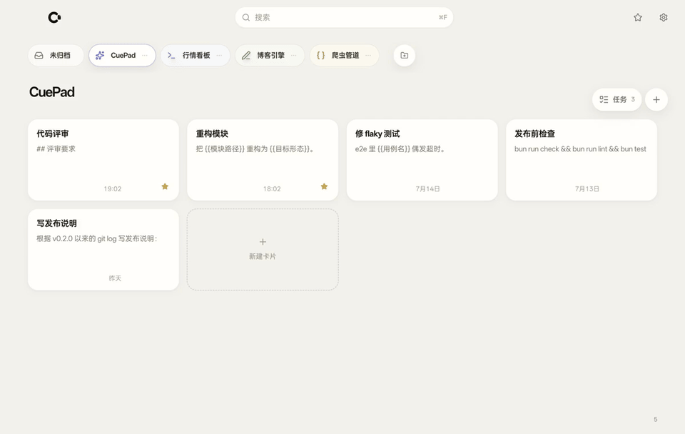
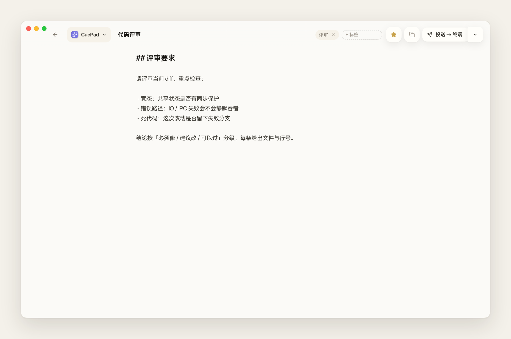
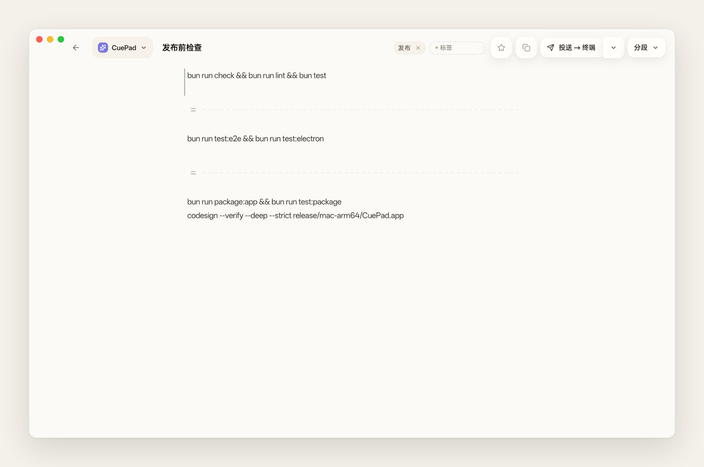
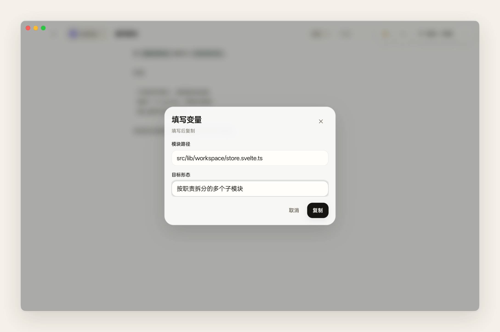
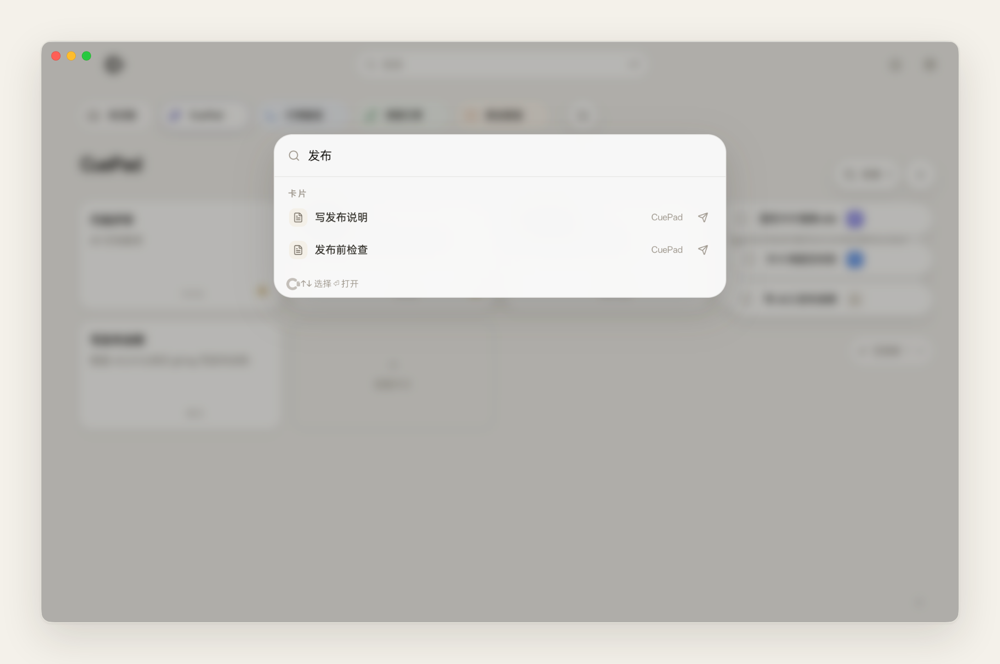
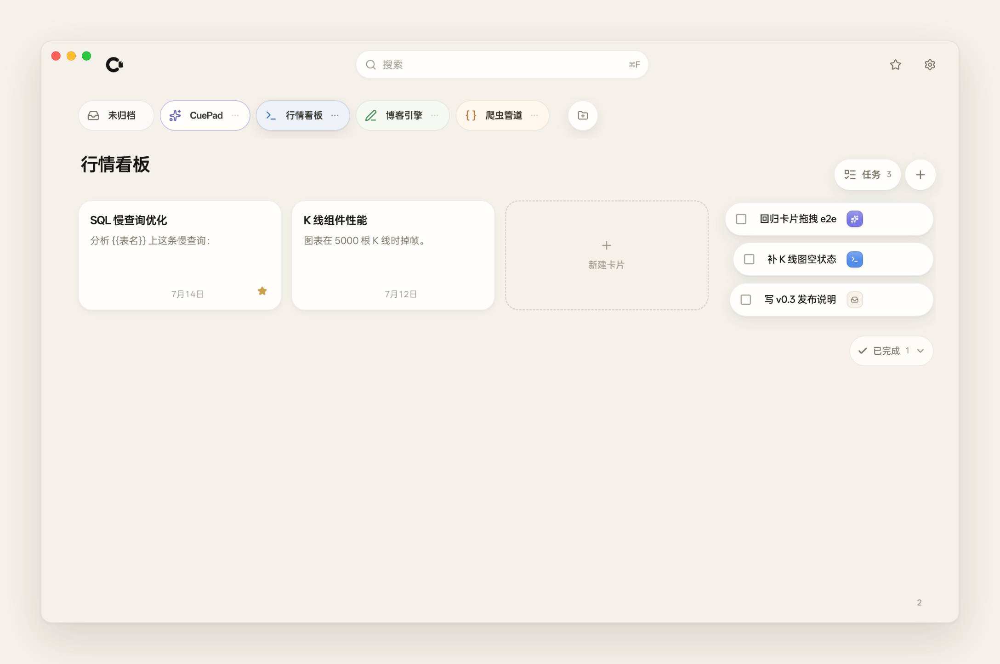
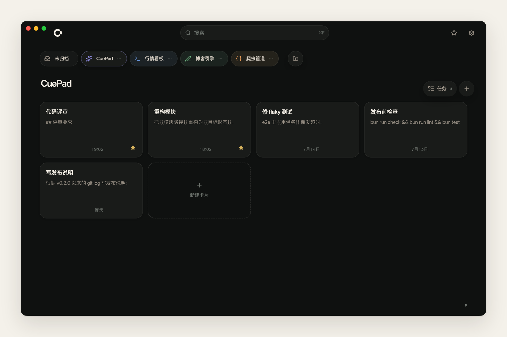

<p align="right"><a href="README.md">English</a> | 简体中文</p>

<p align="center">
  
</p>

<p align="center">
  <a href="LICENSE"></a>
  
</p>

**CuePad 是从想法到提示词的最短路径。** 一块安静的纸感草稿板，伴在你的 coding agents 旁边——舒服地写、逐键自动保存，写好一键把文本送回刚才的终端或编辑器，不切窗口、不找光标。

完全本地：所有卡片保存在你 Mac 上的一个 SQLite 文件里。

<p align="center">
  
</p>

## 功能

- **一键投送**：光标留在目标输入框，呼出 CuePad 点投送——文本直达刚才打字的地方。可固定 Terminal、iTerm、Zed、VSCode；可选「自动发送」替你补按回车。
- **沉浸写作**：全屏卡片，`## 标题`、`- 列表`、代码块、`{{变量}}` 有轻量视觉增强；纯文本进、纯文本出，逐键自动保存。
- **分块**：`Shift+Enter` 把草稿切成多块，整卡或任意一块单独复制/投送，可选编号。
- **变量模板**：复制或投送前集中填写 `{{变量}}`，每张卡记住上次的值。
- **项目 · 收藏 · 任务**：横向项目栏、全局收藏、悬浮待办，还有一个可以反悔的回收站。
- **即时搜索**：`Cmd + F` 随处搜项目、卡片与标签，回车直达。
- **随叫随到**：常驻托盘、关闭即隐藏，`Option + Space`（可自定义）随时唤回；浅色 / 深色 / 跟随系统三种主题。

## 快捷键

| 快捷键 | 作用 |
| --- | --- |
| `Cmd/Ctrl + F` | 搜索 / 命令面板 |
| `Esc` | 退出沉浸编辑 / 关闭面板 |
| `Alt/Option + Space` | 全局显示 / 隐藏窗口（可自定义） |

## 更多截图

<details>
<summary>沉浸编辑 / 分块投送 / 变量模板 / 全局搜索 / 悬浮任务 / 深色主题</summary>
<p align="center">
  
  
  
  
  
  
</p>
</details>

## 下载

Apple Silicon 构建见 [GitHub Releases](https://github.com/Suge8/CuePad/releases)。产品站：[cue-pad.com](https://cue-pad.com)。

ad-hoc 签名、未公证——首次启动请右键选择「打开」。

## 从源码构建

```bash
git clone https://github.com/Suge8/CuePad.git
cd CuePad
bun install
bun run package:app   # release/mac-arm64/CuePad.app + CuePad-<ver>-arm64.zip
```

开发模式运行：`bun run dev:electron`

**环境要求**：[Bun](https://bun.sh)、macOS（Apple Silicon）、Rust 工具链（构建投送 sidecar）。

架构、命令与测试分层见 [docs/development.md](docs/development.md)。

## 参与贡献

欢迎贡献——参见 [CONTRIBUTING.md](.github/CONTRIBUTING.md)；安全问题请看 [SECURITY.md](.github/SECURITY.md)。

## 许可证

Apache License 2.0，详见 [LICENSE](LICENSE)。
